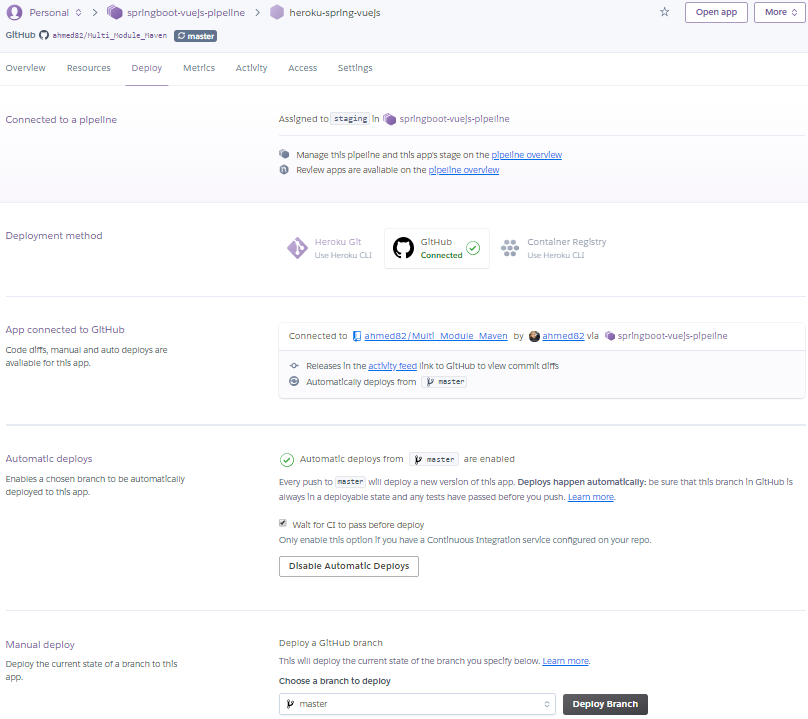
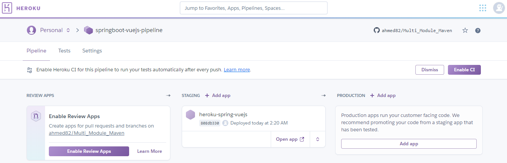

[](https://heroku-spring-vuejs.herokuapp.com)
[](http://hits.dwyl.com/ahmed82/Multi_Module_Maven)
[](https://github.com/dwyl/goodparts "JavaScript The Good Parts")
[](https://github.com/ahmed82/Multi_Module_Maven/)


## Multi Module Maven Project.

### 1. Backend (Java J2EE JEE / Spring Boot Framework)
### 2. Frontend (Vue JS Cli 3)

## Project setup

```
spring-boot-vuejs
├─┬ backend     → backend module with Spring Boot code
│ ├── src
│ └── pom.xml
├─┬ frontend    → frontend module with Vue.js code
│ ├── src
│ └── pom.xml
└── pom.xml     → Maven parent pom managing both modules
```


#### Frontend maven plugin 
ref https://github.com/eirslett/frontend-maven-plugin
### Test the frontend only:
[cd into frontend directory and run CMD]
```
$ npm run serve
```

## Run the application:
on the application root:
```
$ mvn clean install
```

Run our complete Spring Boot App:
```
mvn --projects backend spring-boot:run
```
Need to use 
https://travis-ci.org/

# Heroku

## Deployed in heroku
using Heroku Cli
```
heroku create
```

https://quiet-island-29743.herokuapp.com/ | https://git.heroku.com/quiet-island-29743.git
```
git remote add heroku https://git.heroku.com/quiet-island-29743.git
```
Rename the created application:
```
heroku apps:rename --app quiet-island-29743 heroku-spring-vuejs
```
### Deploy the application to heroku:
```
git push heroku master
```
https://devcenter.heroku.com/articles/getting-started-with-java#deploy-the-app
```
heroku ps:scale web=1
heroku open
heroku logs --tail
```
## Define a Procfile
Heroku apps use "Procfile" file to declare what command should be executed to start the application.
```
web: java -jar target/java-getting-started-1.0.jar
web: java -Dserver.port=$PORT -jar backend/target/backend-2.6.2020.war
```

Application like:
https://heroku-spring-vuejs.herokuapp.com/

Scale the app
```
heroku ps:scale web=0
heroku ps:scale web=1
```
### system.properties
Indicates the version of Java to use (Heroku supports many different versions).
```
java.runtime.version=1.8
```
> You can [try out your Heroku app locally](https://devcenter.heroku.com/articles/heroku-local)! Just create a .env-File with all your Environment variables and run `heroku local`! 
## Automation 
1 Connect the Github repository to the Heroku project 
2 Use Heroku Pipelines feature, where we do get a full Continuous Delivery pipeline


The pipeline setup:

